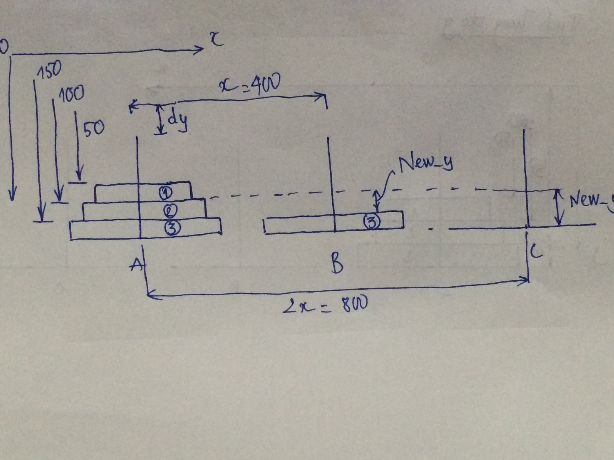
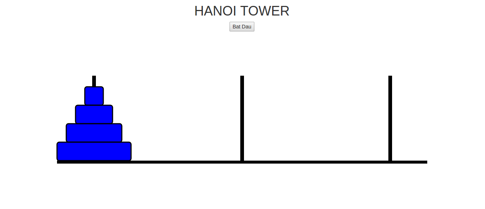
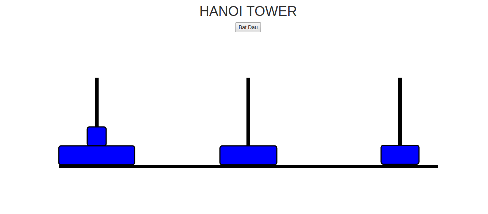
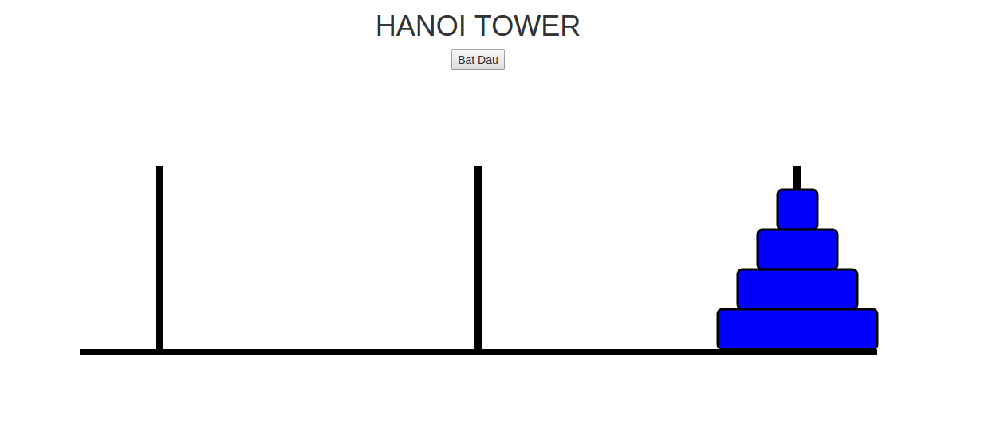

# Tower_of_hanoi
## Sử dụng thư viện D3.js
* Download trực tiếp trên trang chủ D3js.com
* Dùng link CDN
## Phân tích bài toán
* Đặt tên các cọc là A, B, C (ở đây: A = Cọc Nguồn, B = Cọc Trung Gian, C = Cọc Đích).
* Gọi n là tổng số đĩa.
* Đánh số đĩa từ 1 (nhỏ nhất, trên cùng) đến n (lớn nhất, dưới cùng).
## Để chuyển n đĩa từ cọc A sang cọc C cần:
* 1. Chuyển n-1 đĩa từ cọc A sang B. Chỉ còn đĩa n trên cọc A.
* 2. Chuyển đĩa n từ cọc A sang cọc C.
* 3. Chuyển n-1 đĩa từ B sang C cho các đĩa có đường kính nhỏ hơn lần lượt nằm trên đĩa n.
#### Dùng thuật đệ quy để giải quyết bài toán này, tiến hành bước 1 và 3, áp dụng lại thuật giải cho n-1.
### Ví dụ cho 3 đĩa, các bước tiến hành:
1. chuyển đĩa 1 sang cọc C.
2. chuyển đĩa 2 sang cọc B.
3. chuyển đĩa 1 từ C sang B sao cho nó nằm lên 2.
##### Vậy ta hiện có 2 đĩa đã nằm trên cọc B, cọc C hiện thời trống
4. chuyển đĩa 3 sang cọc C
5. lặp lại 3 bước trên để chuyển 1 & 2 cho nằm lên 3.


### Các bước chạy của thuật toán với trường hợp n=3
 ```javascript 
        DISKS =3    |1. Move(N-1,begin,end,med)
                    |2. Move(1,begin,med,end)
                    |3. Move (N-1,med,begin,end)
```
```javascript
                    
                                | Move(1,A,B,C)----------> (chuyển đĩa từ A -> C)(1)
                |Move(2,A,C,B)->| Move(1,A,C,B)----------> (chuyển đĩa từ A -> B)(2)
                |               | Move(1,C,A,B)----------> (chuyển đĩa từ C -> B)(3)
                |
Move(3,A,B,C)-->|Move(1,A,B,C)---------------------------> (chuyển đĩa từ A -> C)(4)
                | 
                |               
                |Move(2,B,A,C)->| Move(1,B,C,A)----------> (chuyển đĩa từ B -> A)(5)
                                | Move(1,B,A,C)----------> (chuyển đĩa từ B -> C)(6)
                                | Move(1,A,B,C)----------> (chuyển đĩa từ A -> C)(7)
```


* Theo sơ đồ trên thì các bước chạy của thuật toán sẽ đi từ (1)..->(7)
* Sau mỗi lần chuyển đĩa thì ta sẽ push dữ liệu vào mảng data với data là 1 mảng bên trong có các phần tử là các mảng kết quả được thực hiện ở mỗi lần kết thúc 1 lệnh gọi đệ quy.
* ví dụ: ở lần 1 kết quả trả ra là 1 mảng có các thành phần là các object như vậy sau 2^n -1 lần gọi đệ quy thì ta sẽ thu được 1 mảng dữ liệu như sau:
```javascript
data = [
            {diskTopick:Disk, fromTower: TowerA, toTower: TowerC}
            .....

    ]
với diskTopick, fromTower, toTower là các đối tượng
```

* Tọa độ y để dịch chuyển đến cọc đích là: 
```javascript
        new_y = n * 50 -(count_disk * 50) - begin_y  
            trong đó n * 50 là tọa độ của đĩa cuối cùng trên cọc, 
            count_disk * 50 là chiều cao của cọc đích, 
            begin_y là tọa độ hiện thời của đĩa được chọn.
```
* Hình vẽ minh họa tính toán:




## Từ hình vẽ ta có thể tính được tọa độ New_y như sau:
### Giả sử ta muốn chuyển đĩa 1 từ cọc A sang cọc C thì làm như sau:
* Đầu tiên tính tọa độ đĩa 1: đĩa 1 có tọa độ ban đầu là y = 50
* Tính độ cao lớn nhất của đĩa tương đương với tọa độ của đĩa cuối cùng = n * 50
với n là tổng số đĩa, 50 là chiều dày của đĩa.
* Xác định số đĩa có trên cọc đích (trường hợp này cọc đích giả sử là cọc C) thì số lượng đĩa sẽ là 0 => chiều cao của cọc đích = số đĩa * 50 =0
* Công thức tính tọa độ y của đĩa sau khi di chuyển sang cọc C: 
## New_y = n*50 - chiều cao cọc đích - tọa độ ban đầu của đĩa 1
- Tọa độ ban đầu của đĩa 1 = 50.
- Khoảng cách giữa A và C =  +800
- Chiều cao cọc đích = 0
- New_y = 3 * 50 - 0 - 50 =100
## Do vậy đĩa 1 sau khi sang di chuyển sang cọc C thì sẽ đi theo chiều dương trục y 1 khoảng New_y = 100 so với vị trí ban đầu

* Tính toán độ đi lên khỏi cọc một khoảng dy của các đĩa được dịch chuyển:  
* Sau đó cần cập nhật lại số lượng đĩa trên mỗi cọc: 
* Thực hiện animation để di chuyển đĩa:
```javascript4
         d3.selectAll('.' + data[i].diskToPick.name)
                .transition()
                .delay(i * animationDelay)
                .duration(animationDuration)
                .attr('transform', 'translate(' + this.begin_x + ',' + this.pickUpHeight + ')')
                .transition()
                .attr('transform', 'translate(' + this.new_x + ',' + this.pickUpHeight + ')')
                .transition()
                .attr('transform', 'translate(' + this.new_x + ',' + this.new_y + ')')

                       
```
* Cuối cùng gán lại tọa độ mới cho x: 
```javascript
        data[i].diskToPick.x_ += this.distenceBetweenTowers
```
* Kết quả bài toán ứng với các trạng thái bắt đầu và kết thúc
* Trạng thái bắt đầu
    

* 1 trong những trạng thái trung gian

    

* Trạng thái kết thúc
    


